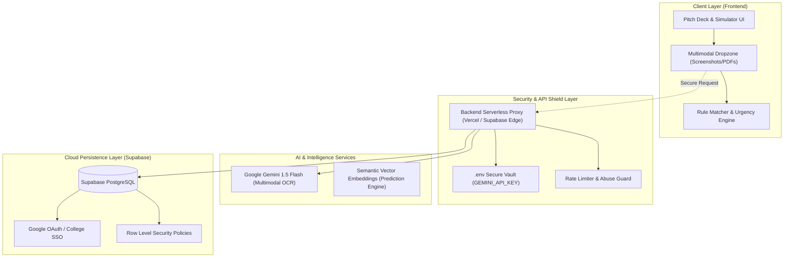

# 🏛️ System Architecture Document

**Project:** Smart Campus AI  
**Author & Lead Architect:** Ayusman ([@Ayus-ProjeXion](https://github.com/Ayus-ProjeXion))  
**Status:** Approved Architecture  
**Version:** 2.0.0  

---

## 1. High-Level Architecture Overview

Smart Campus AI follows a modern, decoupled **3-Tier Architecture** designed for high security, zero API key leakage, and instant client-side performance:



---

## 2. Core Subsystems

### 2.1 Frontend Client (Vanilla Web Architecture)
* **Design Pattern:** Zero-dependency, ultra-fast single page application (SPA).
* **Components:**
  - `Deck Controller`: Presentation mode for hackathon judges and university deans.
  - `Simulator Hub`: Live interactive 3-column processing pipeline.
  - `Notice Ingestion & Dropzone`: FileReader API image processing with instantaneous fallback.
  - `Analytics Engine`: SVG donut visualization and dynamic feed ranking.

### 2.2 Security & Backend Proxy Layer
* **Security Model:** The browser **never** interacts with Google Gemini directly.
* **Flow:**
  1. Frontend submits notice image/text payload to `/api/scan-notice`.
  2. Serverless proxy validates session and rate limits (e.g. 5 scans/minute/user).
  3. Proxy invokes Google Gemini 1.5 Flash using server-side environment secrets.
  4. Returns validated JSON matching the strict Zod entity schema.

### 2.3 Cloud Database Schema (Supabase PostgreSQL)

```sql
-- 1. Students Table
CREATE TABLE students (
    id UUID PRIMARY KEY DEFAULT gen_random_uuid(),
    email TEXT UNIQUE NOT NULL,
    full_name TEXT NOT NULL,
    branch TEXT NOT NULL CHECK (branch IN ('CSE', 'IT', 'ECE', 'MECH', 'CIVIL', 'EE')),
    year INT NOT NULL CHECK (year BETWEEN 1 AND 4),
    cgpa NUMERIC(3, 2) NOT NULL CHECK (cgpa BETWEEN 0.0 AND 10.0),
    active_backlogs INT DEFAULT 0,
    interests TEXT[] DEFAULT '{}',
    created_at TIMESTAMPTZ DEFAULT now()
);

-- 2. Notices Table
CREATE TABLE notices (
    id UUID PRIMARY KEY DEFAULT gen_random_uuid(),
    title TEXT NOT NULL,
    issuer TEXT NOT NULL,
    domain TEXT NOT NULL,
    raw_text TEXT,
    deadline DATE NOT NULL,
    compensation TEXT,
    action_required TEXT NOT NULL,
    created_at TIMESTAMPTZ DEFAULT now()
);

-- 3. Eligibility Criteria Table (Linked to Notices)
CREATE TABLE eligibility_criteria (
    id UUID PRIMARY KEY DEFAULT gen_random_uuid(),
    notice_id UUID REFERENCES notices(id) ON DELETE CASCADE,
    allowed_branches TEXT[] DEFAULT '{"ALL"}',
    min_cgpa NUMERIC(3, 2) DEFAULT 0.0,
    min_year INT DEFAULT 1,
    max_backlogs INT DEFAULT 0
);

-- 4. Student Interactions Table (For AI Interest Prediction Engine)
CREATE TABLE student_interactions (
    id UUID PRIMARY KEY DEFAULT gen_random_uuid(),
    student_id UUID REFERENCES students(id) ON DELETE CASCADE,
    notice_id UUID REFERENCES notices(id) ON DELETE CASCADE,
    action_type TEXT CHECK (action_type IN ('VIEW', 'CALENDAR_SYNC', 'WHATSAPP_DISPATCH', 'TODO_ADD', 'DISMISS')),
    interaction_timestamp TIMESTAMPTZ DEFAULT now()
);
```

---

## 3. Data Integrity & Verification Contract

1. **Entity Extraction (Probabilistic AI):** 
   - Handles messy fonts, low-resolution circular photos, and complex academic tables.
   - Converts unstructured document into structured parameters.
2. **Eligibility Evaluation (Deterministic Rule Engine):**
   - Strictly enforces binary logic:
     $$\text{Eligible} = (\text{Branch} \in \text{Allowed}) \land (\text{CGPA} \ge \text{MinCGPA}) \land (\text{Year} \ge \text{MinYear}) \land (\text{Backlogs} \le \text{MaxBacklogs})$$
   - Guaranteed **Zero Hallucination** on placement thresholds and deadlines.
